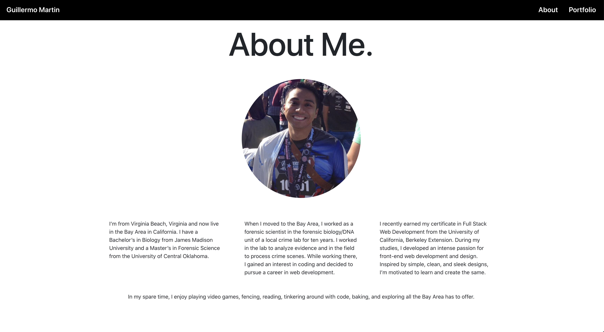
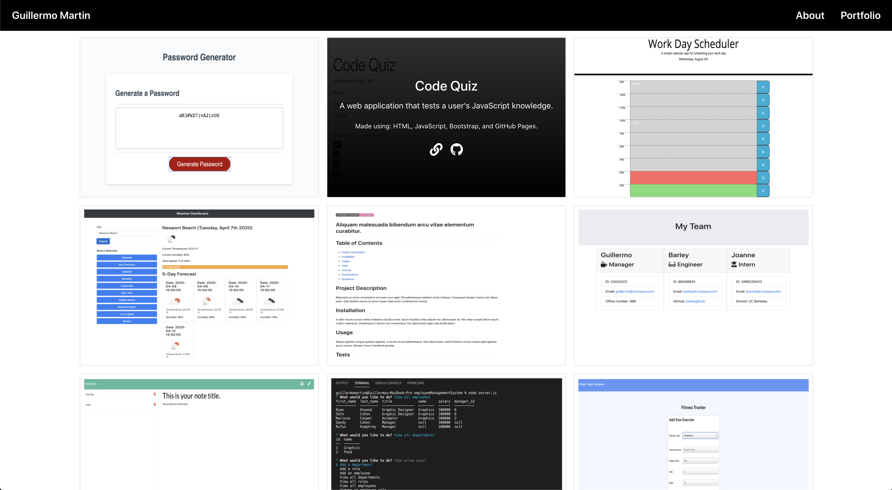

# **Guillermo Martin's Portfolio**

# Description
This is my portfolio and was created to display all of the projects I worked on as a student in the Berkeley Coding Bootcamp at UC Berkeley Extension.  I'll be adding more projects as I continue to grow as a Web developer.

My portfolio can be viewed here:  [Guillermo Martin's Porfolio](https://guillermo-martin.github.io/gcm-portfolio/).

# Technologies
My portfolio was made using [React](https://reactjs.org/), [React Router DOM](https://www.npmjs.com/package/react-router-dom), and [React Bootstrap](https://react-bootstrap.github.io/) and deployed using GitHub pages.

# License
Licensed under the [MIT License](https://spdx.org/licenses/MIT.html).

# Questions
If you have any questions, feel free to contact me at [gscalica@gmail.com](mailto: "gscalica@gmail.com").

# Screenshots

<!-- 
#### This user's email is private. -->

## Homepage

## About Me Section

## Portfolio Page

## Project Cards

